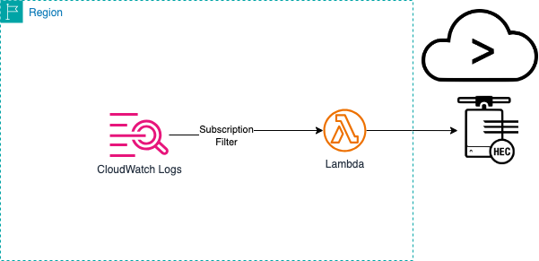

# splunk-aws-lambda-cloudwatchlogs-processor
### Serverless Application for processing CloudWatch Logs to ingest into Splunk over HEC URL

## Content
This repo contains source code and supporting files for a serverless application that you can deploy with the SAM CLI. It includes the following files and folders.

- SplunkLambdaCloudWatchLogsProcessor - Code for the application's Lambda function.
- template.yaml - A template that defines the application's AWS resources.

The resources used by the application are defined in the `template.yaml` file in this project. You can update the template to add AWS resources through the same deployment process that updates your application code.

## Solution Overview
This solution deploys a Lambda function processor to process CloudWatch Logs and ingest into Splunk over HEC endpoint. This solution has options to customize the Lambda function with features like 
including source types, checking acknowledgement for ingested data and debugging features.



## Prerequisites
- AWS SAM CLI, see [AWS SAM prerequisites](https://docs.aws.amazon.com/serverless-application-model/latest/developerguide/prerequisites.html).
- IDE or desktop with python 3.9 installed
## Deployment Steps
1) Clone this repository.
2) Run the SAM Build command to build the application with dependencies.
```
   sam build
```
   Expected output:
```
Building codeuri: /*******/splunk-aws-lambda-cloudwatchlogs-processor/SplunkLambdaCloudWatchLogsProcessor runtime: python3.12 metadata: {}           
architecture: x86_64 functions: SplunkLambdaCloudWatchLogsProcessor                                                                                                         
 Running PythonPipBuilder:ResolveDependencies                                                                                                                               
 Running PythonPipBuilder:CopySource                                                                                                                                        

Build Succeeded

Built Artifacts  : .aws-sam/build
Built Template   : .aws-sam/build/template.yaml

Commands you can use next
=========================
[*] Validate SAM template: sam validate
[*] Invoke Function: sam local invoke
[*] Test Function in the Cloud: sam sync --stack-name {{stack-name}} --watch
[*] Deploy: sam deploy --guided
```
3) Deploy the sam application using guided setup.
```
sam deploy --guided
```
4) Enter the **Stack Name** and preferred **AWS Region** and refer to the following table for the rest of application parameters

| Serverless App Parameter              | Lambda Env. Variable | Description                                                                     | Required | Default Value |   |
|----------------------------------|----------------------|---------------------------------------------------------------------------------|----------|---------------|---|
| SplunkHttpEventCollectorURL      | HEC_HOST             | Splunk HEC Endpoint URL                                                         | YES      | None          |   |
| SplunkHttpEventCollectorToken    | HEC_TOKEN            | Splunk HEC Token                                                                | YES      | None          |   |
| SplunkAcknowledgementRequired    | ACK_REQUIRED         | Check Acknowledgement True or False                                             | NO       | false         |   |
| SplunkAcknowledgementRetries     | ACK_RETRIES          | Number of retries to check acknowledgement                                      | NO       | 5             |   |
| SplunkAcknowledgementWaitSeconds | ACK_WAIT_SECS        | Number of seconds to wait before acknowledgement                                | NO       | 5             |   |
| DebugData                        | DEBUG_DATA           | True or False to print data for debugging                                       | NO       | false         |   |
| ELBCookieName                    | ELB_COOKIE_NAME      | Load balancer Cookie Name. AWSELB for Classic ELB or AWSALB for Applicaiton ELB | NO       | None        |   |
| SplunkHttpEventCollectorType     | HEC_ENDPOINT_TYPE    | HEC input type for raw or event                                                 | NO       | raw           |   |
| HTTPRequestTimeout               | REQUEST_TIMEOUT      | Number of seconds for HTTP requests timeout                                     | NO       | 5             |   |
| SplunkSourceType                 | SOURCE_TYPE          | Splunk Source Type for Data                                                     | YES      | None          |   |
| HTTPVerifySSL                    | VERIFY_SSL           | True or False to verify SSL for HTTP requests                                   | NO       | true          |   |


5) After entering the above application parameters, the deployment will be initialized and CloudFormation stack will be created. Deploy this changeset. Your output should look like below: 
   
```
CloudFormation stack changeset
-------------------------------------------------------------------------------------------------------------------------------------------------------------------------
Operation                                  LogicalResourceId                          ResourceType                               Replacement                              
-------------------------------------------------------------------------------------------------------------------------------------------------------------------------
+ Add                                      SplunkLambdaCloudWatchLogsProcessorRole    AWS::IAM::Role                             N/A                                      
+ Add                                      SplunkLambdaCloudWatchLogsProcessor        AWS::Lambda::Function                      N/A                                      
-------------------------------------------------------------------------------------------------------------------------------------------------------------------------


Changeset created successfully. arn:aws:cloudformation:us-east-1:647604195155:changeSet/samcli-deploy1709084826/81dc07ed-c887-4d21-8098-996e74d4037d


Previewing CloudFormation changeset before deployment
======================================================
Deploy this changeset? [y/N]: y

2024-02-27 20:47:16 - Waiting for stack create/update to complete

CloudFormation events from stack operations (refresh every 5.0 seconds)
-------------------------------------------------------------------------------------------------------------------------------------------------------------------------
ResourceStatus                             ResourceType                               LogicalResourceId                          ResourceStatusReason                     
-------------------------------------------------------------------------------------------------------------------------------------------------------------------------
CREATE_IN_PROGRESS                         AWS::CloudFormation::Stack                 splunk-cloudwatchlogs-processor            User Initiated                           
CREATE_IN_PROGRESS                         AWS::IAM::Role                             SplunkLambdaCloudWatchLogsProcessorRole    -                                        
CREATE_IN_PROGRESS                         AWS::IAM::Role                             SplunkLambdaCloudWatchLogsProcessorRole    Resource creation Initiated              
CREATE_COMPLETE                            AWS::IAM::Role                             SplunkLambdaCloudWatchLogsProcessorRole    -                                        
CREATE_IN_PROGRESS                         AWS::Lambda::Function                      SplunkLambdaCloudWatchLogsProcessor        -                                        
CREATE_IN_PROGRESS                         AWS::Lambda::Function                      SplunkLambdaCloudWatchLogsProcessor        Resource creation Initiated              
CREATE_COMPLETE                            AWS::Lambda::Function                      SplunkLambdaCloudWatchLogsProcessor        -                                        
CREATE_COMPLETE                            AWS::CloudFormation::Stack                 splunk-cloudwatchlogs-processor            -                                        
-------------------------------------------------------------------------------------------------------------------------------------------------------------------------

CloudFormation outputs from deployed stack
-------------------------------------------------------------------------------------------------------------------------------------------------------------------------
Outputs                                                                                                                                                                 
-------------------------------------------------------------------------------------------------------------------------------------------------------------------------
Key                 SplunkLambdaCloudWatchLogsProcessor                                                                                                                 
Description         Splunk CloudWatch Logs function ARN                                                                                                                 
Value               arn:aws:lambda:us-east-1:XXXXXXXXXXXX:function:splunk-cloudwatchlogs-pro-SplunkLambdaCloudWatchLo-*************                                     

Key                 SplunkLambdaCloudWatchLogsProcessorRole                                                                                                             
Description         Implicit IAM Role created for CloudWatch Logs function                                                                                              
Value               arn:aws:lambda:us-east-1:XXXXXXXXXXXX:function:splunk-cloudwatchlogs-pro-SplunkLambdaCloudWatchLo-*************                                  
-------------------------------------------------------------------------------------------------------------------------------------------------------------------------


Successfully created/updated stack - splunk-cloudwatchlogs-processor in us-east-1

```   

6) Now go to CloudWatch Logs in AWS [console](https://console.aws.amazon.com/cloudwatch/home), to create the subscription filter. Select **Log Groups** and pick the log group to configure ingestion for Splunk.
7) Go to subscription filter tab and **Create Lambda subscription filter** under Create pull down menu.
8) Select the Lambda function you created from the SAM deployment, to match the same Physical ID for the the function.
9) Enter subscription filter name and click **Start streaming**.
10) Now your CloudWatch Logs is streamed to Splunk. Check for the data in Splunk Console.

## Best Practices
1) For Lambda scaling, use Reserved or Provisioned [concurency settings](https://docs.aws.amazon.com/lambda/latest/dg/lambda-concurrency.html) for Lambda.
2) If the Splunk indexers are hosted privately in a VPC, you can configure your lambda function for [VPC Access](https://docs.aws.amazon.com/lambda/latest/dg/configuration-vpc.html) for ingesting the CloudWatch Logs data. 
The indexers can be hosted behind an internal Elastic Load Balancers and the Lambda function should have appropriate network access through route table entries, security group rules, NACL rules etc.
3) Deploy the Lambda function for single source type and ensure your Log Groups contains data for that source type. For example: If you deployed the function for cloudtrail log data and configured for the Log Group for CloudTrail data, 
do not use the same Lambda function for VPC Flow Logs. Deploy another function for VPC Flow Log Groups.
3) Use **DEBUG_DATA** Lambda environment variable for debugging and CloudWatch Insights for troubleshooting. Help for troubleshooting with CloudWatch Insights are given below.

## Troubleshooting Lambda function using CloudWatch Insight logs.
Use the CloudWatch Log Insights and select the LogGroup of your deployed lambda function for troubleshooting. You can troubleshoot and monitor the execution of the lambda functions with the following CloudWatch Insight Queries. 
You can also set the **DEBUG_DATA** environment variable to *true* in the lambda function for further troubeshooting.
### To check the error messages
```
fields @message
    | parse @message "[*] *" as loggingType, loggingMessage
    | filter loggingType = "ERROR"
    | display loggingMessage
```

### To check the count of error messages by 5 mins interval
```
fields @message
    | parse @message "[*] *" as loggingType, loggingMessage
    | filter loggingType = "ERROR"
    | stats count() by bin(5m)
```
### To check if there are any connection errors 
```
fields @timestamp, @message  
| filter @message like /Connection Error/ 
```
### To get the count connection errors by 5 mins interval
```
fields @timestamp, @message  
| filter @message like /Connection Error/ 
| stats count() by bin(5m)
```
Tip: Check the network connectivity for any connection errors. If the Lambda function is a public function then ensure the Splunk endpoint is a public endpoint reachable over internet. If the endpoint is firewall protected then check this [link](https://ip-ranges.amazonaws.com/ip-ranges.json) for AWS public IP ranges and ensure the IP ranges for Lambda services for the AWS region where the Lambda runs are in allow list. If you have configured your Lambda for [VPC Access](https://docs.aws.amazon.com/lambda/latest/dg/configuration-vpc.html#vpc-configuring), ensure you have network connectivity to Splunk endpoints from your VPC where Lambda is configured. 

### To check if there are any Acknowledgement Failures
```
fields @timestamp, @message, @logStream, @log
| filter @message Like /Acknowledgement Failed/
```
### Get Acknowledgement success count by 5 mins internval
```
fields @timestamp, @message, @logStream, @log 
| filter @message Like /Ingestion Success: With Acknowledgement/ 
| stats count() by bin(5m)
```

### Get Acknowledgement Failures count by 5 mins interval
```
fields @timestamp, @message, @logStream, @log
| filter @message Like /Acknowledgement Failed/
| stats count() by bin(5m)
```
Tip: The Lambda function checks for ingestion acknowledgement if Application parameter **SplunkAcknowledgementRequired** or Lambda environment variable **ACK_REQUIRED** is set to *true*.  For any acknowledgement failures, try changing the Lambda environment variables for Acknowledgement (ACK_RETRIES & ACK_WAIT_SECS) to a higher values.